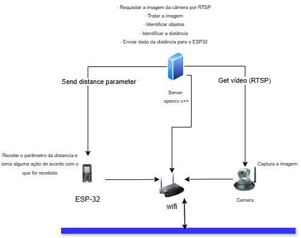

  <h1> Mudança de escopo </h1>
  
Após os testes iniciais, foi identificado que a câmera OV2640 apresentou problemas estruturais que comprometem sua durabilidade e confiabilidade. Assim, optou-se por alterar a arquitetura do projeto, adotando a câmera Speed Dome iCSee, que possui certificações IP67 (resistência à água e poeira) e IK10 (resistência a impactos). Essa câmera foi escolhida por sua robustez e por simplificar a integração com o servidor utilizando o protocolo RTSP.

  <h2>Nova arquitetura</h2>
  
A nova arquitetura integra os seguintes elementos:

1. Câmera Speed Dome iCSee: Captura os frames de vídeo e transmite para o servidor via RTSP.
2. Servidor Central (C++): Processa os frames utilizando a biblioteca OpenCV, identifica objetos e calcula a distância.
3. ESP32: Recebe os dados processados do servidor via HTTP e executa ações baseadas nesses parâmetros.
A nova arquitetura está representada no diagrama abaixo:

  
  <h2>Diagrama de tempo</h2>

  
O fluxo de processamento detalhado é descrito abaixo:

Etapa 1: Captura de Vídeo pela Câmera
Evento: A câmera inicia a captura de vídeo.
Ação: Os frames capturados são enviados ao servidor utilizando o protocolo RTSP.

Etapa 2: Processamento no Servidor
Recepção dos Dados:

O servidor recebe os frames transmitidos pela câmera via RTSP.
Este processo inicia no momento em que o frame é transmitido.

Processamento dos Frames: 
O servidor, utilizando a biblioteca OpenCV, processa o vídeo para:
Identificar objetos relevantes no frame.
Calcular a distância dos objetos identificados.

Etapa 3: Envio do Parâmetro ao ESP32: 
O servidor transmite o parâmetro de distância calculado para o ESP32 via protocolo HTTP.

Recepção do Parâmetro:
O ESP32 recebe o parâmetro enviado pelo servidor e realiza uma ação com base no que foi recebido.

O ESP32 executa uma ação baseada no parâmetro de distância recebido, por exemplo:
Atuar em um motor (ex: ajustar posição).
Ligar um LED indicador.
Transmitir dados para outro sistema.

 <table>
        <thead>
            <tr>
                <th>Etapa</th>
                <th>Descrição</th>
            </tr>
        </thead>
        <tbody>
            <tr>
                <td>Captura e envio (Câmera)</td>
                <td>Enviar frames via RTSP</td>
            </tr>
            <tr>
                <td>Recepção (Servidor)</td>
                <td>Receber dados RTSP</td>
            </tr>
            <tr>
                <td>Processamento (Servidor)</td>
                <td>Análise e cálculo de distâncias</td>
            </tr>
            <tr>
                <td>Envio ao ESP32</td>
                <td>Transmitir parâmetros</td>
            </tr>
            <tr>
                <td>Recepção (ESP32)</td>
                <td>Receber parâmetro</td>
            </tr>
            <tr>
                <td>Execução (ESP32)</td>
                <td>Ação com base nos dados</td>
            </tr>
        </tbody>
    </table>

Segue a imagem do diagrama de tempo:

  

  <h2>Código para requisitar a imagem da câmera</h2>
  

  <h2>Código opencv para identificar objetos e calcular a distância</h2>
